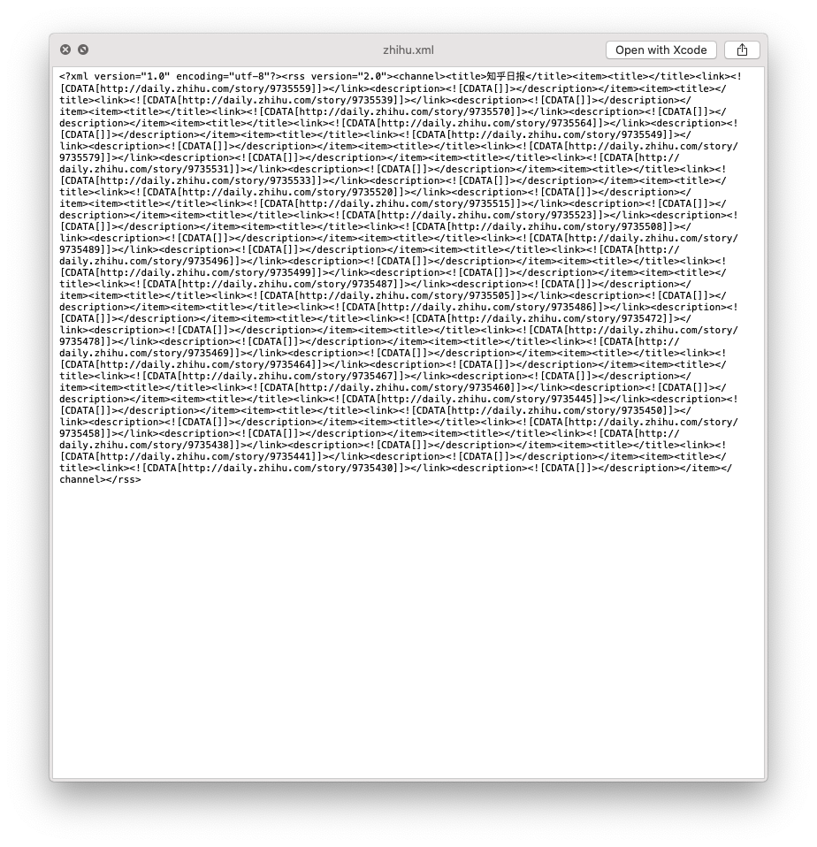
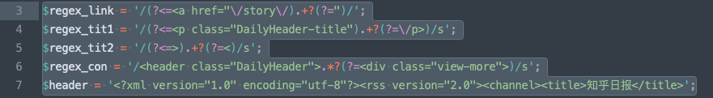
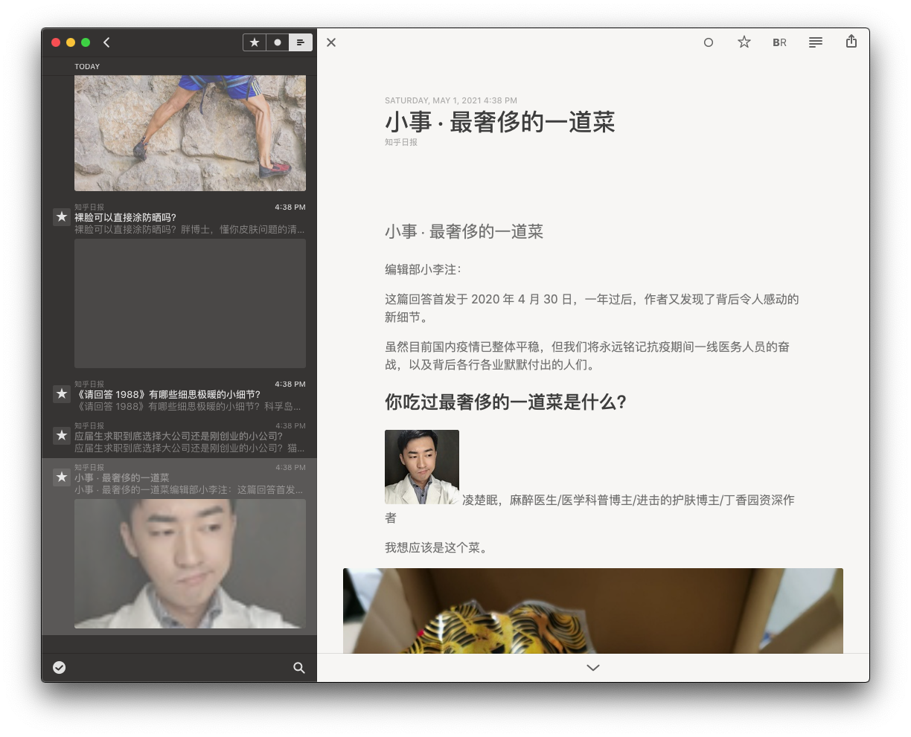
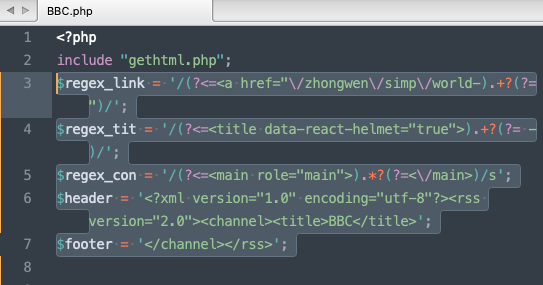
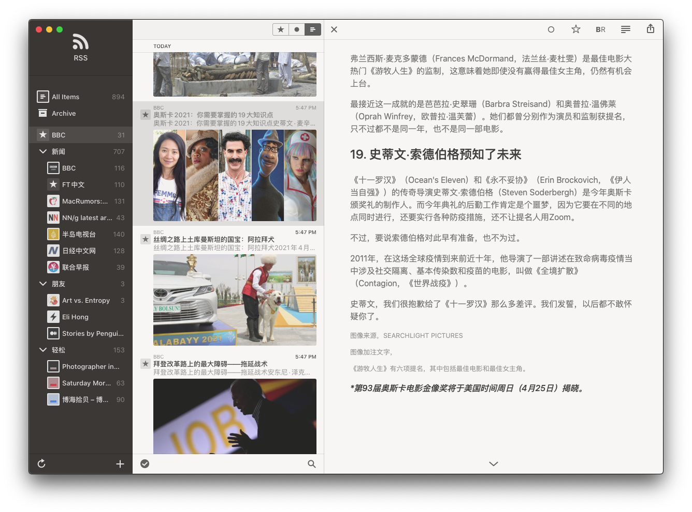

# Developing log

## 2021-05-01

copy the php codes from https://feedx.net/tutorial200316
and https://feedx.net/turorial160710

Test the php script using Mac's local php server: https://stackoverflow.com/questions/19951457/double-click-and-run-the-php-script-on-mac/19951643

- [ ] Need to update php script to properly fetch data from BBC and Nikke.
- [ ] On the server need to use crontab to run php scripts in background with schedule.
- [ ] Need to publish the xml file from server for Reeder to read.

### Take Zhihu Daily as a practice:http://daily.zhihu.com/

However the output of Zhihu Daily is a mess. It successfully fetched the link for each article, but not title, picture or contents.

Need to tweak the regular expression here:

After checking the source code in http://daily.zhihu.com/ while testing in https://regexr.com. I made it work:

I can even use Reeder to import it. Though the cover image is not ideal.

### Adjust for BBC

Adjust the script for https://www.bbc.com/zhongwen/simp

It was quite straightforward. 😃

